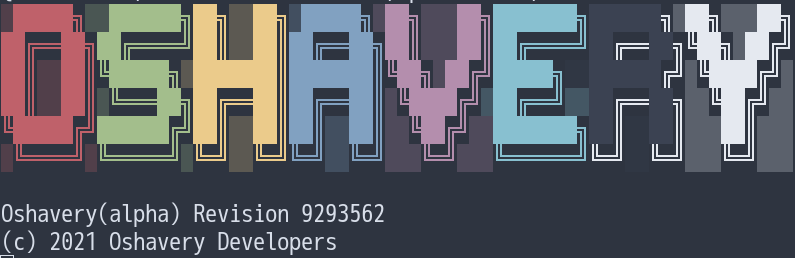
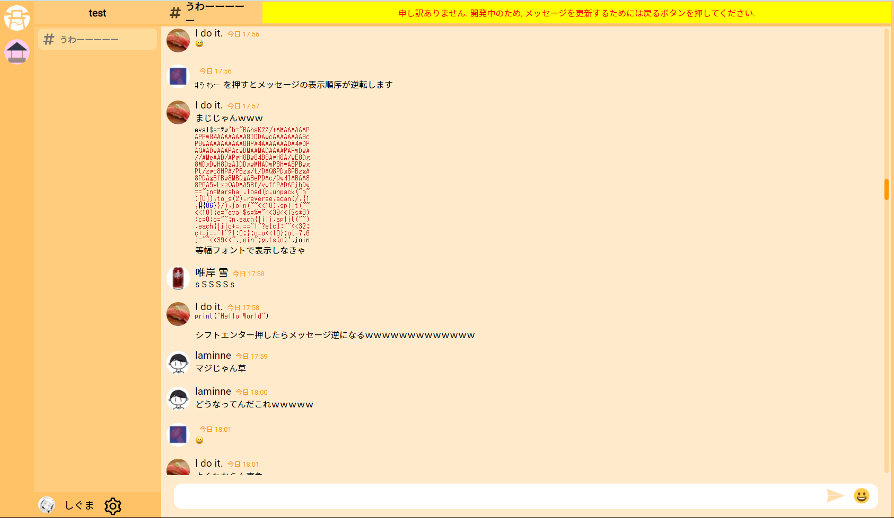

# Discord Like Chat Application `Oshavery`

## Oshaveryについて
Oshavery は Discord ライクなウェブアプリケーションです。
Node.js v14以上で動作します。
このレポジトリはバックエンドのレポジトリです。
フロントエンドはこちらにあります。 [Oshavery-Front](https://github.com/Undecided-Discord/Oshavery-Front)

## Deployment

~~Oshaveryを手元で実行したい方向けのドキュメントはこちらにあります。~~
※準備中です。

## Development

Oshaveryに対してコントリビュートしたい方は[こちら](./docs/development/development.md)をご覧ください

## Authors
|   |  |  |  |
| :--------: | :--------: | :--------: | :---: |
| **Sigumaa** 👔 🔧 | **yusuke4869** 🧢 🔧 | **laminne** 🔧 | **sobonn** 🔧 |

🔧: Developer
🧢: Product Manager
👔: Project Manager

## Special Thanks

### Oshavery Icons & Logo

|   |
| :--------: |
| **Nanai10a**  |

## Licence
MIT

## ScreenShot

